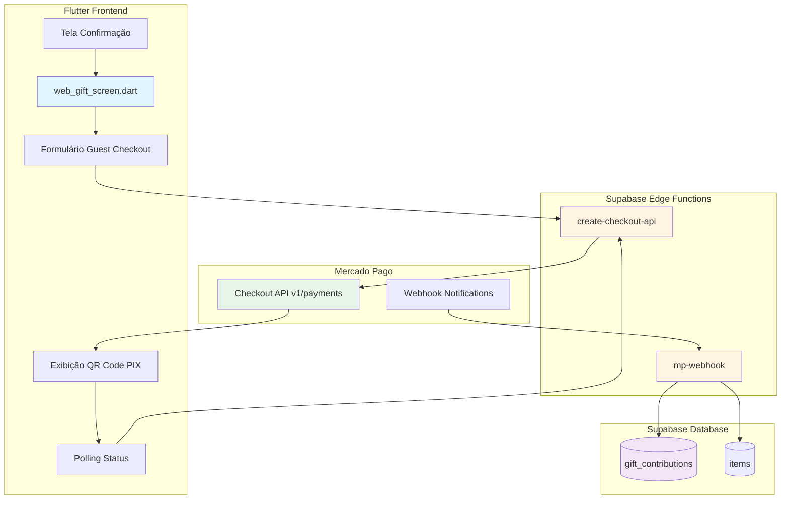
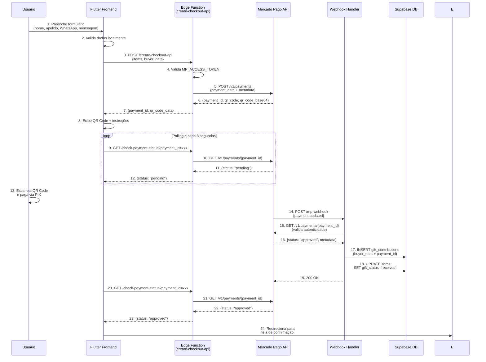
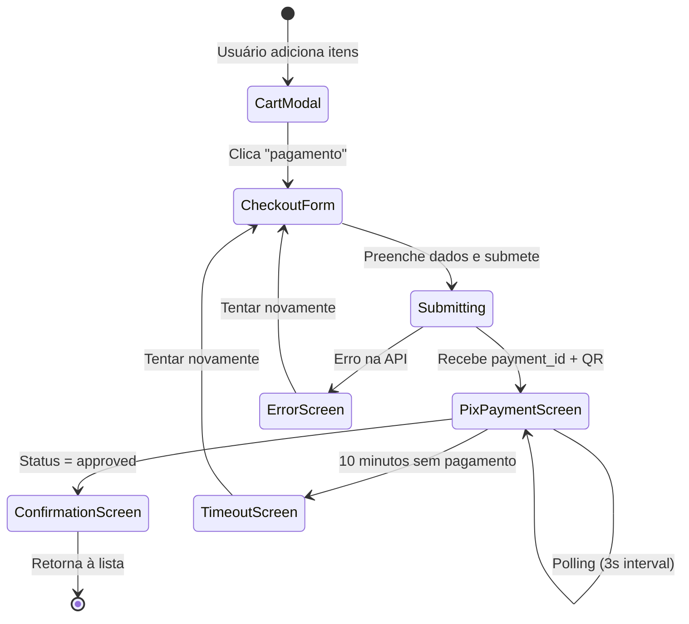
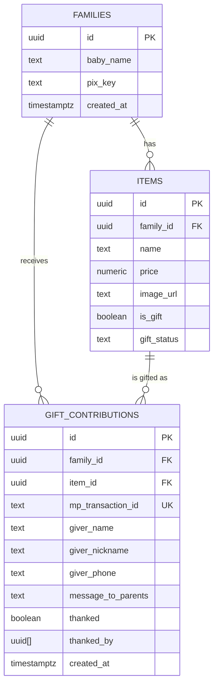
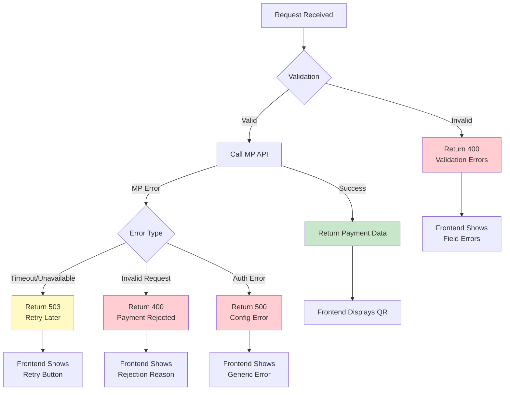

# Design Document: Migração para Mercado Pago Checkout API

## Overview

Este documento detalha o design técnico para migração do sistema de pagamento do aplicativo "Cria" (lista de presentes de bebê) do modelo "Checkout Preferences" (redirecionamento externo) para "Checkout API" (Checkout Transparente) do Mercado Pago.

### Objetivos

1. **Resolver o bug do PIX**: Migrar para Checkout API que oferece suporte robusto ao PIX
2. **Melhorar a experiência do usuário**: Eliminar redirecionamentos externos, mantendo o usuário na aplicação
3. **Manter compatibilidade total**: Preservar 100% da estrutura de banco de dados e funcionalidades existentes
4. **Garantir segurança**: Implementar validação de webhooks e sanitização de dados

### Contexto Técnico

- **Frontend**: Flutter Web (web_gift_screen.dart)
- **Backend**: Supabase Edge Functions (Deno/TypeScript)
- **Banco de Dados**: PostgreSQL via Supabase
- **Pagamentos**: Mercado Pago Checkout API
- **Integração**: MCP Server do Mercado Pago (já instalado)

### Principais Mudanças

| Componente | Estado Atual | Estado Futuro |
|------------|--------------|---------------|
| API do MP | Checkout Preferences | Checkout API (v1/payments) |
| Fluxo de Pagamento | Redirecionamento externo | Transparente (in-app) |
| Exibição PIX | Página externa MP | QR Code + instruções in-app |
| Status de Pagamento | Callback URL | Polling + Webhook |
| Edge Function | create-mp-checkout | create-checkout-api |

## Architecture

### Visão Geral do Sistema



### Fluxo de Dados Completo



### Decisões Arquiteturais

#### 1. Polling vs WebSocket para Status de Pagamento

**Decisão**: Implementar polling a cada 3 segundos

**Justificativa**:
- Simplicidade de implementação no Flutter
- Supabase Edge Functions não suportam WebSocket nativamente
- Timeout de 10 minutos para PIX é aceitável com polling
- Menor complexidade de infraestrutura

**Trade-offs**:
- ✅ Mais simples e confiável
- ✅ Funciona em qualquer ambiente de rede
- ❌ Ligeiramente mais latência (máximo 3 segundos)
- ❌ Mais requisições ao servidor

#### 2. Validação de Webhook

**Decisão**: Validar webhook consultando API do Mercado Pago

**Justificativa**:
- Mercado Pago envia notificações sem assinatura criptográfica robusta
- Consultar GET /v1/payments/{id} garante autenticidade
- Previne ataques de webhook spoofing

**Implementação**:
```typescript
// Webhook recebe notificação
const paymentId = body.data?.id;

// Valida consultando API oficial
const mpResponse = await fetch(
  `https://api.mercadopago.com/v1/payments/${paymentId}`,
  { headers: { 'Authorization': `Bearer ${MP_ACCESS_TOKEN}` } }
);

const paymentData = await mpResponse.json();
// Só processa se status === "approved"
```

#### 3. Armazenamento de Metadados do Comprador

**Decisão**: Enviar buyer_data como metadata no payment request

**Justificativa**:
- Mercado Pago permite até 256 caracteres por campo de metadata
- Webhook retorna metadata completo
- Evita necessidade de tabela temporária no banco

**Estrutura de Metadata**:
```json
{
  "family_id": "uuid",
  "giver_name": "string (max 100 chars)",
  "giver_nickname": "string (max 50 chars)",
  "giver_phone": "string (10-11 digits)",
  "message_to_parents": "string (max 200 chars)",
  "item_ids": "uuid1,uuid2,uuid3"
}
```

## Components and Interfaces

### 1. Flutter Frontend (web_gift_screen.dart)

#### Modificações Necessárias

**Estado Atual**: Redireciona para Mercado Pago externo
**Estado Futuro**: Exibe QR Code PIX e faz polling de status

#### Novos Componentes

##### 1.1 PixPaymentScreen (Widget)

```dart
class PixPaymentScreen extends StatefulWidget {
  final String paymentId;
  final String qrCode;
  final String qrCodeBase64;
  final String familyId;
  
  const PixPaymentScreen({
    required this.paymentId,
    required this.qrCode,
    required this.qrCodeBase64,
    required this.familyId,
  });
}
```

**Responsabilidades**:
- Exibir QR Code PIX (usando qr_flutter package)
- Mostrar código PIX copiável
- Exibir timer de expiração (10 minutos)
- Iniciar polling de status automaticamente
- Redirecionar para confirmação quando aprovado

##### 1.2 PaymentStatusPoller (Service)

```dart
class PaymentStatusPoller {
  final String paymentId;
  final SupabaseClient client;
  Timer? _timer;
  
  Stream<PaymentStatus> startPolling() {
    // Retorna stream que emite status a cada 3 segundos
    // Cancela após 10 minutos ou quando aprovado
  }
  
  void stopPolling() {
    _timer?.cancel();
  }
}
```

#### Fluxo de UI Atualizado



### 2. Edge Function: create-checkout-api

#### Interface

**Endpoint**: `POST /functions/v1/create-checkout-api`

**Request Body**:
```typescript
interface CreateCheckoutRequest {
  items: Array<{
    id: string;           // UUID do item
    name: string;
    price: number;
    qty?: number;         // Default: 1
  }>;
  family_id: string;      // UUID da família
  giver_name: string;     // Nome completo (obrigatório)
  giver_nickname?: string; // Apelido (opcional)
  giver_phone: string;    // WhatsApp com DDD (obrigatório)
  message_to_parents?: string; // Mensagem (opcional)
}
```

**Response Success (200)**:
```typescript
interface CreateCheckoutResponse {
  payment_id: string;     // ID do pagamento no MP
  qr_code: string;        // Código PIX copiável
  qr_code_base64: string; // QR Code em base64 para exibição
  expiration_date: string; // ISO 8601 timestamp
}
```

**Response Error (400/500)**:
```typescript
interface ErrorResponse {
  error: string;          // Mensagem de erro amigável
  details?: string;       // Detalhes técnicos (apenas em dev)
}
```

#### Implementação

```typescript
import { serve } from "https://deno.land/std@0.177.0/http/server.ts";

const corsHeaders = {
  'Access-Control-Allow-Origin': '*',
  'Access-Control-Allow-Methods': 'POST, OPTIONS',
  'Access-Control-Allow-Headers': 'authorization, x-client-info, apikey, content-type',
};

serve(async (req) => {
  if (req.method === 'OPTIONS') {
    return new Response('ok', { headers: corsHeaders });
  }

  try {
    const { 
      items, 
      family_id, 
      giver_name, 
      giver_nickname, 
      giver_phone, 
      message_to_parents 
    } = await req.json();

    // Validação de entrada
    if (!items || items.length === 0) {
      throw new Error('Nenhum item selecionado');
    }
    if (!giver_name || giver_name.trim().length === 0) {
      throw new Error('Nome é obrigatório');
    }
    if (!giver_phone || !/^\d{10,11}$/.test(giver_phone)) {
      throw new Error('WhatsApp inválido (use apenas números com DDD)');
    }

    const MP_ACCESS_TOKEN = Deno.env.get('MP_ACCESS_TOKEN');
    if (!MP_ACCESS_TOKEN) {
      throw new Error('Configuração de pagamento indisponível');
    }

    // Calcula valor total
    const totalAmount = items.reduce((sum, item) => {
      return sum + (Number(item.price) * (item.qty || 1));
    }, 0);

    // Cria payload para Checkout API
    const paymentData = {
      transaction_amount: totalAmount,
      description: `Presente para bebê - ${items.length} item(ns)`,
      payment_method_id: 'pix',
      payer: {
        email: 'guest@cria.app', // Email genérico para guest checkout
        first_name: giver_name.split(' ')[0],
        last_name: giver_name.split(' ').slice(1).join(' ') || giver_name,
      },
      metadata: {
        family_id,
        giver_name,
        giver_nickname: giver_nickname || '',
        giver_phone,
        message_to_parents: message_to_parents || '',
        item_ids: items.map(i => i.id).join(','),
      },
      notification_url: `${Deno.env.get('SUPABASE_URL')}/functions/v1/mp-webhook`,
    };

    // Chama Checkout API do Mercado Pago
    const mpResponse = await fetch('https://api.mercadopago.com/v1/payments', {
      method: 'POST',
      headers: {
        'Authorization': `Bearer ${MP_ACCESS_TOKEN}`,
        'Content-Type': 'application/json',
        'X-Idempotency-Key': crypto.randomUUID(), // Previne duplicação
      },
      body: JSON.stringify(paymentData),
    });

    if (!mpResponse.ok) {
      const errorData = await mpResponse.json();
      console.error('MP API Error:', errorData);
      throw new Error('Erro ao processar pagamento. Tente novamente.');
    }

    const mpData = await mpResponse.json();

    // Extrai dados do PIX
    const pixData = mpData.point_of_interaction?.transaction_data;
    
    return new Response(JSON.stringify({
      payment_id: mpData.id,
      qr_code: pixData?.qr_code || '',
      qr_code_base64: pixData?.qr_code_base64 || '',
      expiration_date: mpData.date_of_expiration,
    }), {
      headers: { ...corsHeaders, 'Content-Type': 'application/json' },
      status: 200,
    });

  } catch (error) {
    console.error('Function error:', error);
    return new Response(JSON.stringify({ 
      error: error.message || 'Erro interno do servidor' 
    }), {
      headers: { ...corsHeaders, 'Content-Type': 'application/json' },
      status: 400,
    });
  }
});
```

### 3. Edge Function: check-payment-status

#### Interface

**Endpoint**: `GET /functions/v1/check-payment-status?payment_id={id}`

**Query Parameters**:
- `payment_id` (string, required): ID do pagamento retornado pelo create-checkout-api

**Response Success (200)**:
```typescript
interface PaymentStatusResponse {
  status: 'pending' | 'approved' | 'rejected' | 'cancelled';
  status_detail?: string;
}
```

#### Implementação

```typescript
import { serve } from "https://deno.land/std@0.177.0/http/server.ts";

const corsHeaders = {
  'Access-Control-Allow-Origin': '*',
  'Access-Control-Allow-Methods': 'GET, OPTIONS',
  'Access-Control-Allow-Headers': 'authorization, x-client-info, apikey, content-type',
};

serve(async (req) => {
  if (req.method === 'OPTIONS') {
    return new Response('ok', { headers: corsHeaders });
  }

  try {
    const url = new URL(req.url);
    const paymentId = url.searchParams.get('payment_id');

    if (!paymentId) {
      throw new Error('payment_id é obrigatório');
    }

    const MP_ACCESS_TOKEN = Deno.env.get('MP_ACCESS_TOKEN');
    if (!MP_ACCESS_TOKEN) {
      throw new Error('Configuração indisponível');
    }

    // Consulta status no Mercado Pago
    const mpResponse = await fetch(
      `https://api.mercadopago.com/v1/payments/${paymentId}`,
      {
        headers: { 'Authorization': `Bearer ${MP_ACCESS_TOKEN}` }
      }
    );

    if (!mpResponse.ok) {
      throw new Error('Erro ao consultar status do pagamento');
    }

    const paymentData = await mpResponse.json();

    return new Response(JSON.stringify({
      status: paymentData.status,
      status_detail: paymentData.status_detail,
    }), {
      headers: { ...corsHeaders, 'Content-Type': 'application/json' },
      status: 200,
    });

  } catch (error) {
    console.error('Status check error:', error);
    return new Response(JSON.stringify({ error: error.message }), {
      headers: { ...corsHeaders, 'Content-Type': 'application/json' },
      status: 400,
    });
  }
});
```

### 4. Edge Function: mp-webhook (Atualizado)

#### Modificações

**Estado Atual**: Processa webhooks do Checkout Preferences
**Estado Futuro**: Processa webhooks do Checkout API

#### Interface

**Endpoint**: `POST /functions/v1/mp-webhook`

**Request Body** (enviado pelo Mercado Pago):
```typescript
interface WebhookNotification {
  action: 'payment.created' | 'payment.updated';
  data: {
    id: string; // payment_id
  };
  type: 'payment';
}
```

#### Implementação Atualizada

```typescript
import { serve } from "https://deno.land/std@0.177.0/http/server.ts";
import { createClient } from "https://esm.sh/@supabase/supabase-js@2.39.3";

serve(async (req) => {
  try {
    const body = await req.json();
    
    // Extrai payment_id da notificação
    const paymentId = body.data?.id;
    const action = body.action;

    console.log(`[Webhook] Received: action=${action}, paymentId=${paymentId}`);

    // Ignora eventos que não são de pagamento
    if (!paymentId || !action?.startsWith('payment.')) {
      console.log('[Webhook] Ignoring non-payment event');
      return new Response('OK', { status: 200 });
    }

    const MP_ACCESS_TOKEN = Deno.env.get('MP_ACCESS_TOKEN');
    const SUPABASE_URL = Deno.env.get('SUPABASE_URL');
    const SERVICE_ROLE_KEY = Deno.env.get('SERVICE_ROLE_KEY');

    if (!MP_ACCESS_TOKEN || !SUPABASE_URL || !SERVICE_ROLE_KEY) {
      throw new Error('Missing environment variables');
    }

    // Valida autenticidade consultando API do Mercado Pago
    const mpResponse = await fetch(
      `https://api.mercadopago.com/v1/payments/${paymentId}`,
      {
        headers: { 'Authorization': `Bearer ${MP_ACCESS_TOKEN}` }
      }
    );

    if (!mpResponse.ok) {
      throw new Error(`Failed to validate payment ${paymentId}`);
    }

    const paymentData = await mpResponse.json();
    console.log(`[Webhook] Payment status: ${paymentData.status}`);

    // Só processa se pagamento foi aprovado
    if (paymentData.status !== 'approved') {
      console.log('[Webhook] Payment not approved yet, skipping persistence');
      return new Response(JSON.stringify({ 
        received: true, 
        status: paymentData.status 
      }), {
        headers: { 'Content-Type': 'application/json' },
        status: 200,
      });
    }

    // Extrai metadata
    const metadata = paymentData.metadata;
    if (!metadata || !metadata.family_id) {
      console.error('[Webhook] Missing metadata in payment');
      return new Response('Missing metadata', { status: 400 });
    }

    const supabase = createClient(SUPABASE_URL, SERVICE_ROLE_KEY);
    const itemIds = metadata.item_ids ? metadata.item_ids.split(',') : [];

    // Insere contribuições no banco (uma por item)
    for (const itemId of itemIds) {
      const transactionKey = `${paymentId}_${itemId}`;

      const { error: insertError } = await supabase
        .from('gift_contributions')
        .upsert({
          mp_transaction_id: transactionKey,
          family_id: metadata.family_id,
          item_id: itemId,
          giver_name: metadata.giver_name || '',
          giver_nickname: metadata.giver_nickname || '',
          giver_phone: metadata.giver_phone || '',
          message_to_parents: metadata.message_to_parents || '',
          thanked: false,
        }, { 
          onConflict: 'mp_transaction_id' // Previne duplicatas
        });

      if (insertError) {
        console.error(`[Webhook] Error inserting contribution ${transactionKey}:`, insertError);
      } else {
        console.log(`[Webhook] Contribution recorded: ${transactionKey}`);
      }

      // Atualiza status do item para "received"
      const { error: updateError } = await supabase
        .from('items')
        .update({ gift_status: 'received' })
        .eq('id', itemId);

      if (updateError) {
        console.error(`[Webhook] Error updating item ${itemId}:`, updateError);
      } else {
        console.log(`[Webhook] Item ${itemId} marked as received`);
      }
    }

    return new Response(JSON.stringify({ 
      received: true, 
      status: 'approved', 
      processed: true 
    }), {
      headers: { 'Content-Type': 'application/json' },
      status: 200,
    });

  } catch (error) {
    console.error('[Webhook] Error:', error.message);
    return new Response(error.message, { status: 500 });
  }
});
```

## Data Models

### Estrutura de Dados Existente (Não Modificada)

#### Tabela: gift_contributions

```sql
CREATE TABLE IF NOT EXISTS public.gift_contributions (
    id UUID DEFAULT gen_random_uuid() PRIMARY KEY,
    family_id UUID REFERENCES public.families(id) ON DELETE CASCADE,
    item_id UUID REFERENCES public.items(id) ON DELETE SET NULL,
    giver_name TEXT NOT NULL,
    giver_nickname TEXT,
    giver_phone TEXT,
    message_to_parents TEXT,
    thanked BOOLEAN DEFAULT false,
    created_at TIMESTAMPTZ DEFAULT NOW(),
    mp_transaction_id TEXT UNIQUE,  -- Adicionado em migração anterior
    thanked_by UUID[] DEFAULT '{}'::UUID[]  -- Adicionado em migração anterior
);
```

**Campos Utilizados**:
- `mp_transaction_id`: Chave única para prevenir duplicatas de webhook (formato: `{payment_id}_{item_id}`)
- `family_id`: Referência à família que receberá o presente
- `item_id`: Referência ao item presenteado
- `giver_name`: Nome completo do presenteador
- `giver_nickname`: Apelido do presenteador (usado no WhatsApp)
- `giver_phone`: Número de WhatsApp (10-11 dígitos)
- `message_to_parents`: Mensagem de carinho para os pais
- `thanked`: Flag indicando se já foi agradecido

#### Tabela: items

```sql
CREATE TABLE IF NOT EXISTS public.items (
    id UUID DEFAULT gen_random_uuid() PRIMARY KEY,
    family_id UUID REFERENCES public.families(id) ON DELETE CASCADE,
    name TEXT NOT NULL,
    price NUMERIC,
    image_url TEXT,
    is_gift BOOLEAN DEFAULT false,
    gift_status TEXT DEFAULT 'available' 
      CHECK (gift_status IN ('available', 'reserved', 'received')),
    created_at TIMESTAMPTZ DEFAULT NOW()
);
```

**Campos Utilizados**:
- `gift_status`: Status do presente
  - `available`: Disponível para presentear
  - `reserved`: Reservado (não usado nesta implementação)
  - `received`: Já foi presenteado e pago

### Fluxo de Dados no Banco



### Validações de Dados

#### Frontend (Flutter)

```dart
class CheckoutFormValidator {
  static String? validateName(String? value) {
    if (value == null || value.trim().isEmpty) {
      return 'Nome é obrigatório';
    }
    if (value.trim().length < 3) {
      return 'Nome deve ter pelo menos 3 caracteres';
    }
    return null;
  }
  
  static String? validatePhone(String? value) {
    if (value == null || value.trim().isEmpty) {
      return 'WhatsApp é obrigatório para agradecimento';
    }
    
    // Remove caracteres não numéricos
    final digitsOnly = value.replaceAll(RegExp(r'\D'), '');
    
    if (digitsOnly.length < 10 || digitsOnly.length > 11) {
      return 'WhatsApp inválido (use DDD + número)';
    }
    
    return null;
  }
  
  static String? validateMessage(String? value) {
    // Mensagem é opcional
    if (value != null && value.length > 200) {
      return 'Mensagem muito longa (máximo 200 caracteres)';
    }
    return null;
  }
}
```

#### Backend (Edge Function)

```typescript
interface ValidationResult {
  isValid: boolean;
  errors: string[];
}

function validateCheckoutData(data: CreateCheckoutRequest): ValidationResult {
  const errors: string[] = [];
  
  // Valida items
  if (!data.items || data.items.length === 0) {
    errors.push('Nenhum item selecionado');
  }
  
  // Valida nome
  if (!data.giver_name || data.giver_name.trim().length < 3) {
    errors.push('Nome inválido (mínimo 3 caracteres)');
  }
  
  // Valida telefone
  const phoneDigits = data.giver_phone?.replace(/\D/g, '') || '';
  if (phoneDigits.length < 10 || phoneDigits.length > 11) {
    errors.push('WhatsApp inválido (use DDD + número)');
  }
  
  // Valida mensagem (opcional, mas com limite)
  if (data.message_to_parents && data.message_to_parents.length > 200) {
    errors.push('Mensagem muito longa (máximo 200 caracteres)');
  }
  
  return {
    isValid: errors.length === 0,
    errors
  };
}
```


## Correctness Properties

*A property is a characteristic or behavior that should hold true across all valid executions of a system-essentially, a formal statement about what the system should do. Properties serve as the bridge between human-readable specifications and machine-verifiable correctness guarantees.*

### Property Reflection

After analyzing all acceptance criteria, the following properties were identified as testable. Some redundant properties were consolidated:

**Consolidated Properties**:
- Properties 4.3, 4.4, and 5.1 all test that approved payments save buyer data → Combined into Property 1
- Properties 5.2 and 5.3 both verify field presence → Combined into Property 2
- Properties 2.5 and 11.2 both validate phone format → Combined into Property 3
- Properties 4.2 and 12.2/12.5 all verify webhook validation → Combined into Property 4
- Properties 3.1 and 1.6 both verify no external redirects → Combined into Property 5

### Property 1: Payment Approval Persists Complete Buyer Data

*For any* approved payment with valid metadata (family_id, giver_name, giver_phone, item_ids), when the webhook handler processes it, the system should create gift_contribution records containing all buyer data fields (giver_name, giver_nickname, giver_phone, message_to_parents) and link them to the correct family_id and item_id.

**Validates: Requirements 4.3, 4.4, 5.1, 5.2, 5.3**

### Property 2: Payment Creation Returns PIX Data

*For any* valid payment request with PIX as payment method, the create-checkout-api function should return a response containing payment_id, qr_code, and qr_code_base64 fields, enabling in-app payment without external redirects.

**Validates: Requirements 1.2, 1.5, 1.6, 3.1, 3.2**

### Property 3: Phone Number Validation

*For any* phone number input, the validation should accept strings with 10-11 digits (after removing non-numeric characters) and reject strings with fewer than 10 or more than 11 digits.

**Validates: Requirements 2.5, 11.2**

### Property 4: Webhook Validates Payment Before Persistence

*For any* webhook notification received, the handler should query the Mercado Pago API to verify payment status before persisting any data to the database, ensuring authenticity and preventing spoofed webhooks.

**Validates: Requirements 4.2, 12.2, 12.5**

### Property 5: Webhook Idempotency

*For any* payment_id, processing the webhook multiple times should result in exactly one gift_contribution record per item_id (using mp_transaction_id as unique key), preventing duplicate contributions from repeated webhook calls.

**Validates: Requirements 4.5**

### Property 6: Item Status Update After Payment

*For any* approved payment containing item_ids in metadata, after the webhook processes successfully, all corresponding items should have their gift_status updated to 'received'.

**Validates: Requirements 4.7**

### Property 7: Default Thanked Flag

*For any* newly created gift_contribution record, the thanked field should default to false, indicating the family has not yet thanked the giver.

**Validates: Requirements 5.4**

### Property 8: Payment Status Polling Returns Current Status

*For any* valid payment_id, querying the check-payment-status endpoint should return the current payment status from Mercado Pago API (pending, approved, rejected, or cancelled).

**Validates: Requirements 3.3**

### Property 9: Payment Expiration Within 10 Minutes

*For any* PIX payment created, the expiration_date returned should be no more than 10 minutes from the creation time, enforcing the PIX timeout requirement.

**Validates: Requirements 3.4**

### Property 10: Required Field Validation

*For any* checkout request, the system should reject requests where giver_name is empty, giver_phone is invalid, or items array is empty, returning specific validation error messages for each missing field.

**Validates: Requirements 2.2, 2.4, 11.1, 11.3, 11.4**

### Property 11: Error Response Structure

*For any* API error (MP unavailable, payment rejected, validation failure), the response should contain a structured error object with a user-friendly message field, enabling proper error display in the UI.

**Validates: Requirements 3.5, 10.1, 10.2**

### Property 12: WhatsApp URL Format

*For any* gift contribution with a valid giver_phone, generating the WhatsApp thank-you URL should produce a string in the format "https://wa.me/{phone}" where {phone} contains only digits.

**Validates: Requirements 8.4**

### Property 13: WhatsApp Message Format

*For any* gift contribution with a giver_nickname, the pre-filled WhatsApp message should follow the format "Oi {nickname}, muito obrigado pelo presente! 💛".

**Validates: Requirements 8.3**

### Property 14: Input Sanitization

*For any* user input (giver_name, message_to_parents), the system should sanitize the input to prevent SQL injection attacks before database insertion, ensuring special characters are properly escaped.

**Validates: Requirements 12.6**

### Property 15: Saved Contributions Are Queryable

*For any* gift_contribution saved to the database, querying the gift_contributions table filtered by family_id should return the contribution with all fields intact, ensuring data is immediately available for the Gift Wall display.

**Validates: Requirements 7.1**


## Error Handling

### Error Categories

#### 1. Validation Errors (400 Bad Request)

**Cenários**:
- Campos obrigatórios vazios (giver_name, giver_phone)
- Formato de telefone inválido
- Array de items vazio
- Valores numéricos inválidos (preço negativo)

**Resposta**:
```json
{
  "error": "Dados inválidos",
  "details": {
    "giver_name": "Nome é obrigatório",
    "giver_phone": "WhatsApp inválido (use DDD + número)"
  }
}
```

**Tratamento no Frontend**:
- Exibir mensagens de erro específicas abaixo de cada campo
- Manter dados preenchidos para correção
- Destacar campos com erro em vermelho

#### 2. Mercado Pago API Errors (502/503)

**Cenários**:
- API do Mercado Pago indisponível
- Timeout na requisição
- Credenciais inválidas
- Rate limiting

**Resposta**:
```json
{
  "error": "Serviço de pagamento temporariamente indisponível. Tente novamente em alguns instantes.",
  "retry": true
}
```

**Tratamento no Frontend**:
- Exibir mensagem amigável com ícone de erro
- Botão "Tentar Novamente" visível
- Não limpar formulário (permitir retry imediato)

#### 3. Payment Rejected (400)

**Cenários**:
- Pagamento rejeitado pelo Mercado Pago
- Dados do pagador inválidos
- Valor fora dos limites permitidos

**Resposta**:
```json
{
  "error": "Pagamento não pôde ser processado",
  "reason": "Valor inválido",
  "retry": true
}
```

**Tratamento no Frontend**:
- Exibir motivo da rejeição
- Sugerir ações corretivas
- Permitir edição e nova tentativa

#### 4. Webhook Validation Errors (400/500)

**Cenários**:
- Webhook com payment_id inválido
- Falha ao consultar API do MP
- Metadata ausente ou incompleto
- Erro ao salvar no banco de dados

**Resposta**:
```json
{
  "error": "Webhook validation failed",
  "payment_id": "123456789"
}
```

**Tratamento**:
- Log detalhado do erro
- Retornar 500 para MP retentar
- Alertar equipe técnica se persistir

#### 5. Database Errors (500)

**Cenários**:
- Falha de conexão com Supabase
- Violação de constraint (mp_transaction_id duplicado)
- Timeout em query

**Resposta**:
```json
{
  "error": "Erro interno do servidor. Nossa equipe foi notificada."
}
```

**Tratamento**:
- Log completo do erro
- Não expor detalhes técnicos ao usuário
- Webhook: retornar 500 para retry automático

### Error Handling Flow



### Retry Strategy

#### Frontend Retry Logic

```dart
class PaymentRetryHandler {
  static const int maxRetries = 3;
  static const Duration retryDelay = Duration(seconds: 2);
  
  Future<PaymentResponse> createPaymentWithRetry(
    PaymentRequest request,
    {int attempt = 1}
  ) async {
    try {
      return await _createPayment(request);
    } catch (e) {
      if (attempt < maxRetries && _isRetryable(e)) {
        await Future.delayed(retryDelay * attempt);
        return createPaymentWithRetry(request, attempt: attempt + 1);
      }
      rethrow;
    }
  }
  
  bool _isRetryable(dynamic error) {
    // Retry em erros de rede e 503
    return error is NetworkException || 
           error is ServerUnavailableException;
  }
}
```

#### Webhook Retry Logic

O Mercado Pago automaticamente retenta webhooks que retornam status 5xx:
- 1ª tentativa: imediata
- 2ª tentativa: após 5 minutos
- 3ª tentativa: após 15 minutos
- Até 12 tentativas em 24 horas

**Nossa estratégia**:
- Retornar 200 para eventos processados com sucesso
- Retornar 200 para eventos ignorados (não-payment)
- Retornar 500 para erros temporários (DB down, MP API down)
- Retornar 400 para erros permanentes (metadata inválido)

### Logging Strategy

#### Log Levels

**INFO**: Operações normais
```typescript
console.log('[Payment] Created payment_id:', paymentId);
console.log('[Webhook] Processed approved payment:', paymentId);
```

**WARN**: Situações anormais mas recuperáveis
```typescript
console.warn('[Webhook] Duplicate webhook call for payment:', paymentId);
console.warn('[Payment] MP API slow response time:', responseTime);
```

**ERROR**: Falhas que impedem operação
```typescript
console.error('[Payment] MP API error:', error.message, {
  request: sanitizedRequest,
  response: errorResponse,
  timestamp: new Date().toISOString()
});
```

#### Sensitive Data Handling

**Nunca logar**:
- MP_ACCESS_TOKEN completo
- Dados de cartão (não aplicável, mas por segurança)
- Senhas ou secrets

**Sanitizar antes de logar**:
- Telefones: mostrar apenas últimos 4 dígitos
- Emails: mostrar apenas domínio
- Tokens: mostrar apenas primeiros 8 caracteres

```typescript
function sanitizeForLog(data: any): any {
  return {
    ...data,
    giver_phone: data.giver_phone?.slice(-4).padStart(11, '*'),
    mp_access_token: data.mp_access_token?.slice(0, 8) + '...',
  };
}
```


## Testing Strategy

### Dual Testing Approach

Esta implementação requer tanto testes unitários quanto testes baseados em propriedades para garantir cobertura completa:

**Unit Tests**: Validam exemplos específicos, casos extremos e condições de erro
**Property-Based Tests**: Verificam propriedades universais através de múltiplas entradas geradas

Ambos são complementares e necessários:
- Unit tests capturam bugs concretos e casos específicos
- Property tests verificam corretude geral através de randomização

### Property-Based Testing Configuration

**Framework Selecionado**: 
- **Backend (Deno/TypeScript)**: [fast-check](https://github.com/dubzzz/fast-check)
- **Frontend (Flutter/Dart)**: [test](https://pub.dev/packages/test) com geradores customizados

**Configuração Mínima**:
- Mínimo 100 iterações por teste de propriedade
- Seed fixo para reproduzibilidade de falhas
- Timeout de 30 segundos por teste

**Tag Format**:
Cada teste de propriedade deve referenciar a propriedade do design:

```typescript
// Feature: mercadopago-checkout-api-migration, Property 1: Payment Approval Persists Complete Buyer Data
test('approved payment saves all buyer data fields', async () => {
  await fc.assert(
    fc.asyncProperty(
      approvedPaymentArbitrary(),
      async (payment) => {
        // Test implementation
      }
    ),
    { numRuns: 100 }
  );
});
```

### Unit Testing Strategy

#### Backend Edge Functions

**create-checkout-api Tests**:

```typescript
// Exemplo: Validação de entrada
test('rejects empty giver_name', async () => {
  const request = {
    items: [{ id: 'uuid', name: 'Item', price: 100 }],
    family_id: 'uuid',
    giver_name: '',
    giver_phone: '11987654321',
  };
  
  const response = await createCheckout(request);
  
  assertEquals(response.status, 400);
  assertStringIncludes(response.body.error, 'Nome é obrigatório');
});

// Exemplo: Formato de resposta
test('returns payment_id and qr_code on success', async () => {
  const request = validCheckoutRequest();
  
  const response = await createCheckout(request);
  
  assertEquals(response.status, 200);
  assert(response.body.payment_id);
  assert(response.body.qr_code);
  assert(response.body.qr_code_base64);
});

// Exemplo: Tratamento de erro do MP
test('handles MP API unavailable gracefully', async () => {
  mockMercadoPagoAPI({ status: 503 });
  
  const response = await createCheckout(validCheckoutRequest());
  
  assertEquals(response.status, 503);
  assertStringIncludes(response.body.error, 'temporariamente indisponível');
});
```

**mp-webhook Tests**:

```typescript
// Exemplo: Ignora eventos não-payment
test('ignores non-payment events', async () => {
  const webhook = {
    action: 'subscription.updated',
    data: { id: '123' }
  };
  
  const response = await handleWebhook(webhook);
  
  assertEquals(response.status, 200);
  assertEquals(response.body, 'OK');
});

// Exemplo: Valida payment antes de salvar
test('queries MP API before persisting data', async () => {
  const mpAPISpy = spy();
  mockMercadoPagoAPI({ status: 200, data: approvedPayment() }, mpAPISpy);
  
  await handleWebhook(paymentWebhook());
  
  assert(mpAPISpy.called);
});

// Exemplo: Idempotência
test('handles duplicate webhook calls', async () => {
  const webhook = paymentWebhook({ payment_id: '123' });
  
  await handleWebhook(webhook);
  await handleWebhook(webhook); // Segunda chamada
  
  const contributions = await db.query('gift_contributions');
  assertEquals(contributions.length, 1); // Apenas um registro
});
```

**check-payment-status Tests**:

```typescript
// Exemplo: Retorna status atual
test('returns current payment status from MP', async () => {
  mockMercadoPagoAPI({ 
    status: 200, 
    data: { status: 'approved' } 
  });
  
  const response = await checkPaymentStatus('payment_123');
  
  assertEquals(response.body.status, 'approved');
});

// Exemplo: Valida payment_id obrigatório
test('requires payment_id parameter', async () => {
  const response = await checkPaymentStatus(null);
  
  assertEquals(response.status, 400);
  assertStringIncludes(response.body.error, 'payment_id é obrigatório');
});
```

#### Frontend Flutter Tests

**Validation Tests**:

```dart
// Exemplo: Validação de nome
test('validateName rejects empty string', () {
  final result = CheckoutFormValidator.validateName('');
  expect(result, 'Nome é obrigatório');
});

test('validateName accepts valid name', () {
  final result = CheckoutFormValidator.validateName('João Silva');
  expect(result, null);
});

// Exemplo: Validação de telefone
test('validatePhone rejects invalid format', () {
  final result = CheckoutFormValidator.validatePhone('123');
  expect(result, contains('WhatsApp inválido'));
});

test('validatePhone accepts 11 digits', () {
  final result = CheckoutFormValidator.validatePhone('11987654321');
  expect(result, null);
});
```

**Widget Tests**:

```dart
// Exemplo: Exibição de QR Code
testWidgets('PixPaymentScreen displays QR code', (tester) async {
  await tester.pumpWidget(
    MaterialApp(
      home: PixPaymentScreen(
        paymentId: '123',
        qrCode: 'pix_code',
        qrCodeBase64: 'base64_data',
        familyId: 'family_123',
      ),
    ),
  );
  
  expect(find.byType(QrImage), findsOneWidget);
  expect(find.text('pix_code'), findsOneWidget);
});

// Exemplo: Polling de status
testWidgets('starts polling on mount', (tester) async {
  final pollingSpy = MockPaymentStatusPoller();
  
  await tester.pumpWidget(
    MaterialApp(
      home: PixPaymentScreen(
        paymentId: '123',
        poller: pollingSpy,
      ),
    ),
  );
  
  verify(pollingSpy.startPolling()).called(1);
});
```

### Property-Based Testing Strategy

#### Backend Property Tests

**Property 1: Payment Approval Persists Complete Buyer Data**

```typescript
// Feature: mercadopago-checkout-api-migration, Property 1
test('approved payment saves all buyer data fields', async () => {
  await fc.assert(
    fc.asyncProperty(
      fc.record({
        payment_id: fc.uuid(),
        family_id: fc.uuid(),
        item_ids: fc.array(fc.uuid(), { minLength: 1, maxLength: 5 }),
        giver_name: fc.string({ minLength: 3, maxLength: 100 }),
        giver_nickname: fc.option(fc.string({ maxLength: 50 })),
        giver_phone: fc.string({ minLength: 10, maxLength: 11 }).filter(s => /^\d+$/.test(s)),
        message_to_parents: fc.option(fc.string({ maxLength: 200 })),
      }),
      async (paymentData) => {
        // Mock MP API to return approved payment
        mockMercadoPagoAPI({
          status: 200,
          data: {
            id: paymentData.payment_id,
            status: 'approved',
            metadata: {
              family_id: paymentData.family_id,
              giver_name: paymentData.giver_name,
              giver_nickname: paymentData.giver_nickname || '',
              giver_phone: paymentData.giver_phone,
              message_to_parents: paymentData.message_to_parents || '',
              item_ids: paymentData.item_ids.join(','),
            }
          }
        });
        
        // Process webhook
        await handleWebhook({
          action: 'payment.updated',
          data: { id: paymentData.payment_id }
        });
        
        // Verify all items have contributions
        for (const itemId of paymentData.item_ids) {
          const contribution = await db.queryOne(
            'gift_contributions',
            { mp_transaction_id: `${paymentData.payment_id}_${itemId}` }
          );
          
          assert(contribution !== null);
          assertEquals(contribution.family_id, paymentData.family_id);
          assertEquals(contribution.item_id, itemId);
          assertEquals(contribution.giver_name, paymentData.giver_name);
          assertEquals(contribution.giver_phone, paymentData.giver_phone);
        }
      }
    ),
    { numRuns: 100 }
  );
});
```

**Property 2: Payment Creation Returns PIX Data**

```typescript
// Feature: mercadopago-checkout-api-migration, Property 2
test('valid payment request returns PIX data', async () => {
  await fc.assert(
    fc.asyncProperty(
      fc.record({
        items: fc.array(
          fc.record({
            id: fc.uuid(),
            name: fc.string({ minLength: 1, maxLength: 100 }),
            price: fc.double({ min: 1, max: 10000 }),
          }),
          { minLength: 1, maxLength: 10 }
        ),
        family_id: fc.uuid(),
        giver_name: fc.string({ minLength: 3, maxLength: 100 }),
        giver_phone: fc.string({ minLength: 10, maxLength: 11 }).filter(s => /^\d+$/.test(s)),
      }),
      async (request) => {
        // Mock MP API success
        mockMercadoPagoAPI({
          status: 200,
          data: {
            id: fc.sample(fc.uuid(), 1)[0],
            point_of_interaction: {
              transaction_data: {
                qr_code: 'generated_qr_code',
                qr_code_base64: 'base64_data',
              }
            },
            date_of_expiration: new Date(Date.now() + 10 * 60 * 1000).toISOString(),
          }
        });
        
        const response = await createCheckout(request);
        
        assertEquals(response.status, 200);
        assert(response.body.payment_id);
        assert(response.body.qr_code);
        assert(response.body.qr_code_base64);
        assert(response.body.expiration_date);
      }
    ),
    { numRuns: 100 }
  );
});
```

**Property 3: Phone Number Validation**

```typescript
// Feature: mercadopago-checkout-api-migration, Property 3
test('phone validation accepts 10-11 digits only', () => {
  fc.assert(
    fc.property(
      fc.string(),
      (phone) => {
        const digitsOnly = phone.replace(/\D/g, '');
        const isValid = digitsOnly.length >= 10 && digitsOnly.length <= 11;
        
        const validationResult = validatePhone(phone);
        
        if (isValid) {
          assertEquals(validationResult, null);
        } else {
          assert(validationResult !== null);
          assertStringIncludes(validationResult, 'inválido');
        }
      }
    ),
    { numRuns: 100 }
  );
});
```

**Property 5: Webhook Idempotency**

```typescript
// Feature: mercadopago-checkout-api-migration, Property 5
test('processing webhook multiple times creates single contribution', async () => {
  await fc.assert(
    fc.asyncProperty(
      fc.record({
        payment_id: fc.uuid(),
        item_id: fc.uuid(),
        family_id: fc.uuid(),
      }),
      fc.integer({ min: 2, max: 5 }), // Number of webhook calls
      async (paymentData, numCalls) => {
        mockMercadoPagoAPI({
          status: 200,
          data: {
            id: paymentData.payment_id,
            status: 'approved',
            metadata: {
              family_id: paymentData.family_id,
              item_ids: paymentData.item_id,
              giver_name: 'Test',
              giver_phone: '11987654321',
            }
          }
        });
        
        // Call webhook multiple times
        for (let i = 0; i < numCalls; i++) {
          await handleWebhook({
            action: 'payment.updated',
            data: { id: paymentData.payment_id }
          });
        }
        
        // Verify only one contribution exists
        const contributions = await db.query(
          'gift_contributions',
          { mp_transaction_id: `${paymentData.payment_id}_${paymentData.item_id}` }
        );
        
        assertEquals(contributions.length, 1);
      }
    ),
    { numRuns: 100 }
  );
});
```

### Integration Testing

**End-to-End Flow Test**:

```typescript
test('complete payment flow from creation to webhook', async () => {
  // 1. Create payment
  const checkoutRequest = {
    items: [{ id: 'item_123', name: 'Carrinho', price: 150 }],
    family_id: 'family_123',
    giver_name: 'João Silva',
    giver_phone: '11987654321',
    message_to_parents: 'Parabéns!',
  };
  
  const createResponse = await createCheckout(checkoutRequest);
  assertEquals(createResponse.status, 200);
  const paymentId = createResponse.body.payment_id;
  
  // 2. Check initial status (pending)
  const statusResponse1 = await checkPaymentStatus(paymentId);
  assertEquals(statusResponse1.body.status, 'pending');
  
  // 3. Simulate MP webhook (payment approved)
  await handleWebhook({
    action: 'payment.updated',
    data: { id: paymentId }
  });
  
  // 4. Check updated status (approved)
  const statusResponse2 = await checkPaymentStatus(paymentId);
  assertEquals(statusResponse2.body.status, 'approved');
  
  // 5. Verify contribution saved
  const contribution = await db.queryOne(
    'gift_contributions',
    { mp_transaction_id: `${paymentId}_item_123` }
  );
  assert(contribution !== null);
  assertEquals(contribution.giver_name, 'João Silva');
  
  // 6. Verify item status updated
  const item = await db.queryOne('items', { id: 'item_123' });
  assertEquals(item.gift_status, 'received');
});
```

### Test Coverage Goals

**Mínimo Aceitável**:
- Line Coverage: 80%
- Branch Coverage: 75%
- Function Coverage: 90%

**Áreas Críticas (100% coverage)**:
- Validação de entrada
- Webhook processing
- Error handling
- Database operations

### Continuous Testing

**Pre-commit Hooks**:
```bash
#!/bin/bash
# Run unit tests before commit
deno test --coverage=coverage/
flutter test --coverage

# Check coverage thresholds
deno coverage coverage/ --lcov > coverage.lcov
lcov --summary coverage.lcov | grep "lines" | awk '{if ($2 < 80) exit 1}'
```

**CI/CD Pipeline**:
1. Run all unit tests
2. Run property-based tests (100 iterations)
3. Run integration tests
4. Generate coverage report
5. Fail build if coverage < 80%

