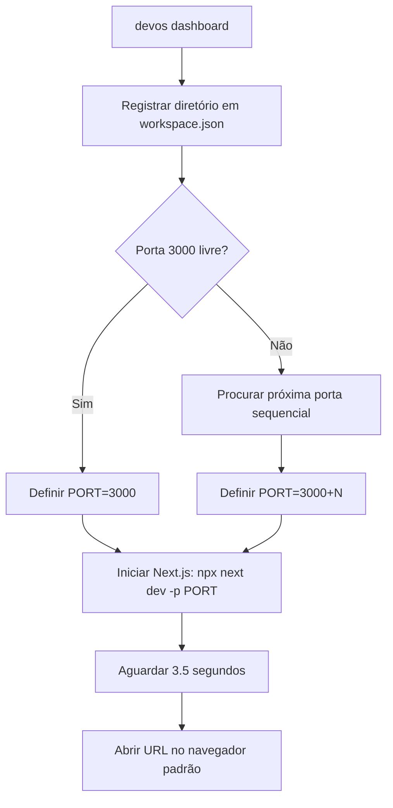

# CLI Module Specifications

## Objetivo
Descrever o funcionamento técnico e arquitetural da CLI do DevOS 2.0 (`@devos/cli`).

---

## Estrutura do Módulo

O código-fonte da CLI reside integralmente na pasta `cli/` na raiz do projeto:

- `cli/src/index.ts`: Ponto de entrada do executável node. Configura o `Commander.js` e define os comandos (`init`, `create-devos`, `dashboard`, `doctor`, `generate`, `update`, `brief`, `import`, `update-status`, `update-tasks`).
- `cli/src/commands/`: Diretório contendo os executores lógicos de cada comando.
  - `init.ts`: Criação do workspace local, diretório `docs/` e cópia dos templates de documentação.
  - `doctor.ts`: Orquestração de relatórios e status de saída de diagnósticos.
  - `dashboard.ts`: Inicializador de processos paralelos Next.js com fallback de porta e navegador automático.
  - `generate.ts` e `update.ts`: Empacotadores de arquivos SSOT para prompts ricos de IA.
  - `brief.ts`: Orquestrador de prompt para geração do `PROJECT_BRIEF.md` inicial.
  - `import.ts`: Mapeador de diretórios recursivos para criação de `PROJECT_BRIEF.md` em projetos existentes.
  - `update-status.ts` e `update-tasks.ts`: Empacotadores focados na atualização de status e tarefas locais.
- `cli/src/lib/`:
  - `doctor-engine.ts`: Core lógicos de auditoria estrutural e sintática.
  - `workspace.ts`: Leitura e persistência de workspaces globais em `~/.devos/workspace.json`.
  - `clipboard.ts`: Adapter para copiar textos para a área de transferência usando `clipboardy`.

---

## Fluxo de Execução do `devos dashboard`

---

## Integração CI/CD (`devos doctor --ci`)

O comando `devos doctor --ci` avalia o score de integridade do projeto. Se houver qualquer erro do tipo `error` (por exemplo, ausência de arquivos obrigatórios do SSOT ou quebras graves de YAML Frontmatter), o comando interrompe o pipeline com `process.exit(1)`, bloqueando o merge da pull request.
